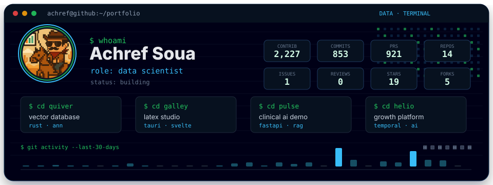

  <code>open</code>
  &nbsp;
  <a href="https://github.com/achref-soua/quiver">Quiver</a>
  ·
  <a href="https://github.com/achref-soua/galley">Galley</a>
  ·
  <a href="https://github.com/achref-soua/pulse">Pulse</a>
  ·
  <a href="https://github.com/achref-soua/helio">Helio</a>

The profile card refreshes daily at 06:17 UTC. Contribution, commit, pull request,
issue, and review counts cover the last 365 days; activity bars cover the last 30 days.
Repository, star, and fork counts reflect public repositories.
